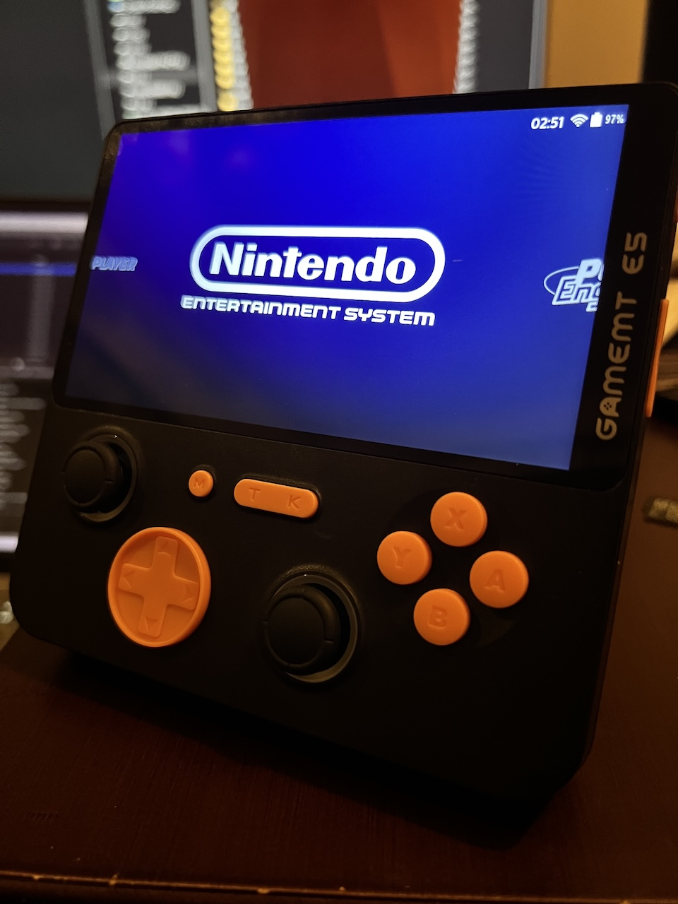

  
  
   
   


[Latest Version 0.1](https://github.com/game-de-it/plumOS-E5P/releases/tag/plumOS-E5P_0.1) 

---
# はじめに
[Click here for the English version of the explanation](./README_EN.md)

plumOS-E5PはJELOSをベースに作られたCFWです。 
コミュニティーによる素晴らしい情報に感謝いたします。  
- redditコミュニティー  
https://www.reddit.com/r/SBCGaming/comments/1hg5w9e/i_just_got_my_gamemt_e5_plus_since_there_is_very/?rdt=41092

- GameMTオフィシャルサイト  
http://gamemt.net/index.php/2024/11/11/e6-e5-plus-%E5%AE%89%E5%8D%93linux%E7%B3%BB%E7%BB%9F%E5%88%B7%E6%9C%BA%E6%95%99%E7%A8%8B/


# 対応機種
- GmameMT E5 Plus

# ダウンロード
[「Releasesページ」からSDイメージファイルをダウンロードできます](https://github.com/game-de-it/plumOS-E5P/releases)

# 基本的な機能
- [pyxel](https://github.com/kitao/pyxel) が利用可能
- E5 Plus用にチューニングされたイコライザー機能が利用可能
  - イコライザー機能を恒久的に無効化したい場合は、Emulationstationの`tools`セクションにある`Equalizer`を実行してください
- picoarchが利用可能
- Portmasterの起動に関するバグとコントローラーレイアウトの修正
- drasticのキーバインドの修正
- シンプルな外見のplumOS用のESテーマ(時刻が表示されます)
- Toolsセクションを英語に翻訳
- SSH接続のアカウント情報
  - ユーザ名は `root` 、パスワードは `plumos`


# pyxelについて
- 対応している拡張子は`.py`と`.pyxapp`
- オンラインアップデートを利用する場合はwifiに接続してEmulationstationの`Tools`セクションにある`pyxel_update`を実行します
- pythonモジュールを追加したい場合
  - 下記のシェルスクリプトの例を`roms/ports`ディレクトリに配置して、Emulationstationの`ports`セクションからこのスクリプトを実行します(全てのモジュールがインストールできるとは限りません)
    ```
    #!/bin/sh
    /storage/pyxel_Python/bin/python3 -m pip install pygame
    ```

# OSのホットキー
| Button Combo | Action | 
|:-----------|------------:|
| T+Vol+       |        画面輝度を上げる |
| T+Vol-       |        画面輝度を下げる |


# picoarchについて
- T＋Kボタンでメニューが開きます
  - オプションメニューで設定を変更したら必ず「save config」をしてください
  - 設定項目によってはpicoarchの再実行が必要になります
- picoarchに関連するファイルやセーブデータは「/storage/.config/.picoarch/」に保存されます
- picoarch HDとLDの利用方法
  - エミュレーターセクション全体の設定  
    - ROM選択画面で「セレクトキー → システム詳細設定 → エミュレーター」の順に進み、「picoarch_HD」と「picoarch_LD」を選択します。 
  - ROMごとの設定  
    - ROMファイルにカーソルを合わせて"Xボタン" → "このゲームの詳細設定" → "エミュレーター"の順に進み、"picoarch_HD"と"picoarch_LD"を選択します。(エミュレーターセクション全体の設定よりもこの設定が優先されます)
- picoarch対応コア一覧  

| cores name | type | 
|:-----------|------------:|
| beetle_ngp_libretro.so  | neogeo pocket(color) |
| smsplus-gx_libretro.so| gamegear,sms |
| picodrive_libretro.so | megadrive,gamegear,sms |
| quicknes_libretro.so | nes,fds |
| fceumm_libretro.so | nes,fds |
| beetle-pce-fast_libretro.so | pcengine(CD) |    
| gambatte_libretro.so | gb(color) |
| gpsp_libretro.so | gba |     
| mgba_libretro.so | gba |
| pcsx_rearmed_libretro.so  | psx |
| beetle_wswan_libretro.so | wonderswan(color) |
| snes9x2010_libretro.so | snes |
| pokemini_libretro.so | pokemini |

- デフォルトのホットキー一覧
  - ※Button Comboに表示されているキーのみHotkeyの設定を変更可能です

| Button Combo | Action | 
|:-----------|------------:|
| T+K       |        picoarchメニュー表示 |
| T+R       |        ステートセーブ |
| T+L     |      ステートロード |
| T+R2     |      fastforward(早送りx3倍速) |
| T+L2     |      FPS表示/非表示 |


# Retroarchについて
- セーブファイル(.srm)はromファイルと同じフォルダに作成されます(変更可能)
- ステートセーブファイルはromファイルと同じフォルダに作成されます(変更可能)
- RetroArchのホットキー
  - ※Hotkeyの設定は自由に変更可能です

| Button Combo | Action | 
|:-----------|------------:|
| T+B       |        Retroarchメニュー表示 |
| T+K       |        Retroarchの終了 |
| T+R       |        ステートセーブ |
| T+L     |      ステートロード |
| T+R2     |      ファストフォワード(早送りx2倍) |
| T+L2     |      スローモーション(x1.5倍) |
| T+X     |      スナップショット(roms/screenshots) |
| T+Y     |      FPS表示 |


# 各エミュレータのデータ保存場所
- セーブデータのバックアップなどをする際に参考にしてください

| Emulator | DIR | 
|:-----------|------------:|
| drastic       |        /storage/.config/drastic |
| ppsspp       |         /storage/.config/ppsspp |
| retroarch    |       各romディレクトリ内 |
| picoarch | /storage/.config/.picoarch/data |

