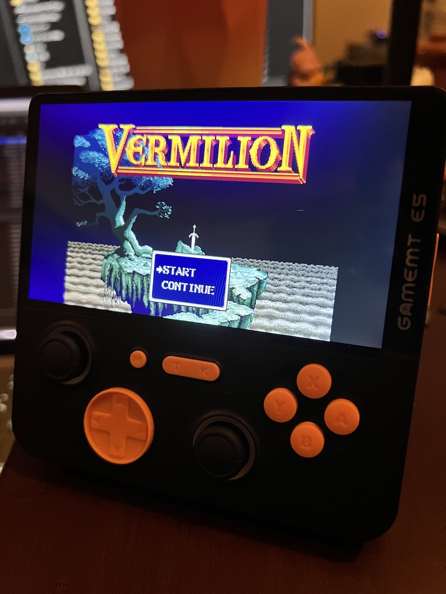

  
  
   
   

[Latest Version 0.1](https://github.com/game-de-it/plumOS-E5P/releases/tag/plumOS-E5P_0.1)

---

# Introduction

[Click here for the English version of the explanation](./README_EN.md)

plumOS-E5P is a CFW based on JELOS.\
We appreciate the wonderful information provided by the community.

- Reddit community\
  [https://www.reddit.com/r/SBCGaming/comments/1hg5w9e/i\_just\_got\_my\_gamemt\_e5\_plus\_since\_there\_is\_very/?rdt=41092](https://www.reddit.com/r/SBCGaming/comments/1hg5w9e/i_just_got_my_gamemt_e5_plus_since_there_is_very/?rdt=41092)

- GameMT Official Site\
  [http://gamemt.net/index.php/2024/11/11/e6-e5-plus-%E5%AE%89%E5%8D%93linux%E7%B3%BB%E7%BB%9F%E5%88%B7%E6%9C%BA%E6%95%99%E7%A8%8B/](http://gamemt.net/index.php/2024/11/11/e6-e5-plus-%E5%AE%89%E5%8D%93linux%E7%B3%BB%E7%BB%9F%E5%88%B7%E6%9C%BA%E6%95%99%E7%A8%8B/)

# Supported Devices

- GameMT E5 Plus

# Download

[Download the SD image file from the "Releases" page](https://github.com/game-de-it/plumOS-E5P/releases)

# Basic Features

- [pyxel](https://github.com/kitao/pyxel) is available
- An equalizer function tuned for E5 Plus is available
  - To permanently disable the equalizer function, run `Equalizer` in the `Tools` section of Emulationstation
- picoarch is available
- Fixed Portmaster startup issues and controller layout
- Fixed drastic key bindings
- A simple ES theme for plumOS (time is displayed)
- Translated the Tools section into English
- SSH connection account information
  - Username: `root`, Password: `plumos`

# About pyxel

- Supported extensions: `.py` and `.pyxapp`
- To use online updates, connect to WiFi and execute `pyxel_update` in the `Tools` section of Emulationstation
- To add Python modules
  - Place the following shell script in the `roms/ports` directory and execute it from the `ports` section of Emulationstation (not all modules can be installed):
    ```
    #!/bin/sh  
    /storage/pyxel_Python/bin/python3 -m pip install pygame  
    ```

# OS Hotkeys

| Button Combo | Action                     |
| ------------ | -------------------------- |
| T+Vol+       | Increase screen brightness |
| T+Vol-       | Decrease screen brightness |

# About picoarch

- Open the menu with T + K button
  - After changing settings in the options menu, always select "save config"
  - Some settings require restarting picoarch
- Files and save data related to picoarch are stored in `/storage/.config/.picoarch/`
- Using picoarch HD and LD
  - **Global emulator settings**
    - In the ROM selection screen, navigate to "Select Key → Advanced System Options → Emulator" and choose either `picoarch_HD` or `picoarch_LD`.
  - **Per-ROM settings**
    - Highlight the ROM file and navigate to "X button → Game-specific Options → Emulator" to select `picoarch_HD` or `picoarch_LD` (this takes priority over global settings).
- List of supported picoarch cores

| Core Name                    | Type                       |
| ---------------------------- | -------------------------- |
| beetle\_ngp\_libretro.so     | Neo Geo Pocket (Color)     |
| smsplus-gx\_libretro.so      | Game Gear, SMS             |
| picodrive\_libretro.so       | Mega Drive, Game Gear, SMS |
| quicknes\_libretro.so        | NES, FDS                   |
| fceumm\_libretro.so          | NES, FDS                   |
| beetle-pce-fast\_libretro.so | PC Engine (CD)             |
| gambatte\_libretro.so        | GB (Color)                 |
| gpsp\_libretro.so            | GBA                        |
| mgba\_libretro.so            | GBA                        |
| pcsx\_rearmed\_libretro.so   | PSX                        |
| beetle\_wswan\_libretro.so   | WonderSwan (Color)         |
| snes9x2010\_libretro.so      | SNES                       |
| pokemini\_libretro.so        | PokéMini                   |

- Default Hotkeys
  - Only the keys displayed in "Button Combo" can have their hotkeys changed

| Button Combo | Action                  |
| ------------ | ----------------------- |
| T+K          | Open picoarch menu      |
| T+R          | Save state              |
| T+L          | Load state              |
| T+R2         | Fast forward (x3 speed) |
| T+L2         | Show/hide FPS           |

# About Retroarch

- Save files (.srm) are created in the same folder as the ROM file (configurable)
- State save files are created in the same folder as the ROM file (configurable)
- RetroArch Hotkeys
  - Hotkey settings can be freely changed

| Button Combo | Action                                        |
| ------------ | --------------------------------------------- |
| T+B          | Open Retroarch menu                           |
| T+K          | Exit Retroarch                                |
| T+R          | Save state                                    |
| T+L          | Load state                                    |
| T+R2         | Fast forward (x2 speed)                       |
| T+L2         | Slow motion (x1.5 speed)                      |
| T+X          | Take a snapshot (saved in `roms/screenshots`) |
| T+Y          | Show FPS                                      |

# Save Data Locations for Each Emulator

- Use this information when backing up save data

| Emulator  | DIR                             |
| --------- | ------------------------------- |
| drastic   | /storage/.config/drastic        |
| ppsspp    | /storage/.config/ppsspp         |
| retroarch | Inside each ROM directory       |
| picoarch  | /storage/.config/.picoarch/data |

